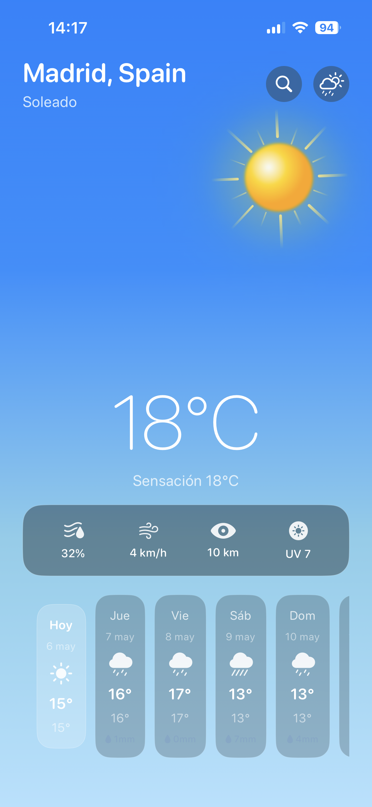
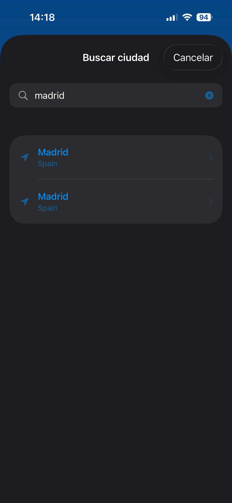
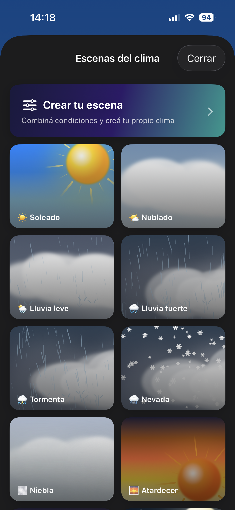
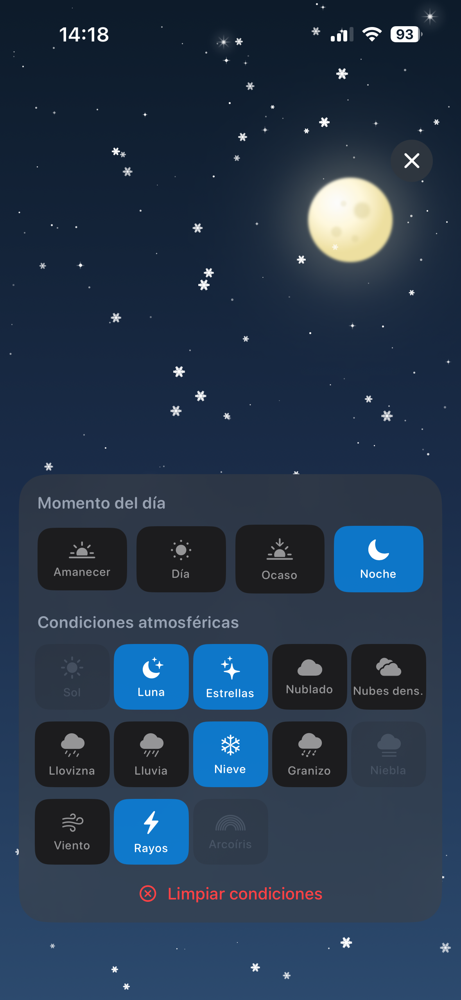
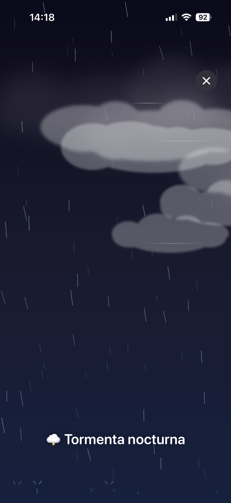

# WeatherApp 🌤️

App iOS de clima en tiempo real con escenas atmosféricas animadas. Muestra el tiempo actual y el pronóstico de cualquier ciudad del mundo usando datos reales de WeatherAPI.com, con una escena visual que cambia dinámicamente según las condiciones meteorológicas detectadas.

---

## Capturas de pantalla

| Principal | Búsqueda | Escenas | Creador | Detalle |
|-----------|----------|---------|---------|---------|
|  |  |  |  |  |

---

## API

Esta app utiliza [WeatherAPI.com](https://www.weatherapi.com).

| Endpoint | Descripción |
|----------|-------------|
| `GET /current.json?key={KEY}&q={lat},{lon}&aqi=no&lang=es` | Clima actual por coordenadas |
| `GET /forecast.json?key={KEY}&q={lat},{lon}&days={days}&aqi=no&lang=es` | Pronóstico extendido |
| `GET /search.json?key={KEY}&q={query}&limit=10` | Búsqueda de ciudades |

Requiere API key gratuita en [weatherapi.com](https://www.weatherapi.com/signup.aspx). El plan gratuito incluye clima actual, 3 días de pronóstico y búsqueda de ciudades.

---

## Arquitectura

El proyecto sigue **Clean Architecture** con tres capas explícitas y **MVVM** en la capa de presentación:

```
WeatherApp/
├── App/
│   ├── AppEnvironment.swift       # Inyección de dependencias centralizada
│   └── WeatherApp.swift
├── Core/
│   ├── Extensions/
│   │   └── Color+Hex.swift
│   └── Location/
│       └── LocationManager.swift  # CoreLocation + @Observable
├── Data/
│   ├── Mappers/
│   │   └── WeatherMapper.swift    # DTO → Entidad de dominio
│   ├── Network/
│   │   ├── WeatherAPIClient.swift
│   │   ├── WeatherAPIModels.swift
│   │   └── WeatherSearchModels.swift
│   └── Repositories/
│       ├── WeatherRepository.swift
│       └── MockWeatherRepository.swift
├── Domain/
│   ├── Models/
│   │   ├── WeatherCondition.swift  # OptionSet combinable y atómico
│   │   ├── WeatherData.swift
│   │   ├── ForecastDay.swift
│   │   └── Location.swift
│   ├── Repositories/
│   │   └── WeatherRepositoryProtocol.swift
│   └── UseCases/
│       └── FetchWeatherUseCase.swift
└── Presentation/
    ├── Main/
    │   ├── Components/
    │   │   ├── CurrentWeatherOverlay.swift
    │   │   ├── ForecastDayCard.swift
    │   │   └── ForecastScrollView.swift
    │   ├── MainView.swift
    │   └── MainViewModel.swift
    ├── Search/
    │   ├── CitySearchView.swift
    │   └── CitySearchViewModel.swift
    ├── Showcase/
    │   ├── Components/
    │   │   └── ShowcaseCardView.swift
    │   ├── WeatherShowcaseView.swift
    │   └── WeatherShowcaseViewModel.swift
    ├── WeatherPicker/
    │   └── ConditionPickerView.swift
    └── WeatherScene/
        └── Components/
            ├── SkyBackgroundView.swift
            ├── CloudsView.swift
            ├── RainView.swift
            ├── SnowView.swift
            ├── HailView.swift
            ├── FogView.swift
            ├── LightningView.swift
            ├── MoonView.swift
            ├── StarsView.swift
            ├── SunView.swift
            ├── WindView.swift
            └── RainbowView.swift
```

### Decisiones técnicas

**WeatherCondition como OptionSet**
Las condiciones climáticas se modelan como un `OptionSet` combinable. Cada condición es atómica e independiente — `.rainy`, `.thunder`, `.windy` — y se combinan para formar presets complejos como `.stormyNight = [.night, .denseClouds, .rainy, .thunder, .windy]`. Esto permite que la capa de presentación reaccione a cada condición de forma granular sin lógica condicional anidada.

**Separación Data / Domain / Presentation**
Domain no conoce nada de red ni de UI. Data implementa el protocolo de repositorio definido en Domain. Presentation solo interactúa con Domain a través de UseCases. Las dependencias se inyectan por `init` en cada capa, haciéndolas testeables de forma independiente sin frameworks externos de mocking.

**Escenas animadas con TimelineView**
Cada efecto visual (lluvia, nieve, granizo, niebla, viento) es un componente SwiftUI independiente que usa `TimelineView` y `Canvas` para renderizar partículas. La arquitectura permite combinar cualquier subconjunto de efectos observando el `WeatherCondition` actual.

**Ubicación con manejo de permisos**
`LocationManager` usa `@Observable` y maneja los tres estados posibles: sin determinar (muestra ciudad por defecto), autorizado (actualiza a ubicación real vía `onChange`) y denegado (muestra mensaje de error con instrucciones). La lógica de permisos está desacoplada del ViewModel.

---

## Stack tecnológico

| | |
|---|---|
| Lenguaje | Swift 5 |
| UI | SwiftUI |
| Concurrencia | async/await, `@Observable` (iOS 17) |
| Ubicación | CoreLocation |
| Arquitectura | MVVM + Clean Architecture (Domain / Data / Presentation) |
| Testing | XCTest + swift-snapshot-testing 1.19.2 |
| iOS mínimo | iOS 17.0 |
| Dispositivos | iPhone only · Portrait only |

---
## Cómo ejecutar

1. Clona el repositorio:
```bash
git clone https://github.com/jcreyesdev/WeatherApp.git
```

2. Abre en Xcode:
```bash
cd WeatherApp
open WeatherApp.xcodeproj
```

3. Selecciona un simulador (iOS 17+) y presiona **⌘R**

No se requiere configuración adicional. La API key ya está incluida en el proyecto.

---

## Ejecutar tests

Presiona **⌘U** en Xcode.

### Cobertura de tests

| Capa | Archivo | Tests | Qué cubre |
|------|---------|-------|-----------|
| Domain | `WeatherConditionTests` | 21 | Combinabilidad del OptionSet, insert/remove, presets, displayName, sfSymbol, isDay/isNight, atomicidad |
| Domain | `FetchWeatherUseCaseTests` | 9 | execute (éxito, error, condición), executeForecastDays (count, límite, error), executeSearch (resultados, ciudad inexistente, error) |
| Data | `WeatherMapperTests` | 14 | mapCondition día/noche (códigos API), mapLocation, temperatura, humedad, mapForecastDays (count, fecha, fecha inválida) |
| Presentation | `WeatherSceneViewModelTests` | 24 | Estado inicial, fetchWeather éxito/fallo, selectLocation, updateCondition, computed properties, retry |
| Snapshots | `WeatherSceneSnapshotTests` | 9 | SkyBackground (7 condiciones), MainView (3 condiciones), ForecastDayCard (3 variantes) |

---

## Autor

Desarrollado por [@jcreyesdev](https://github.com/jcreyesdev)
